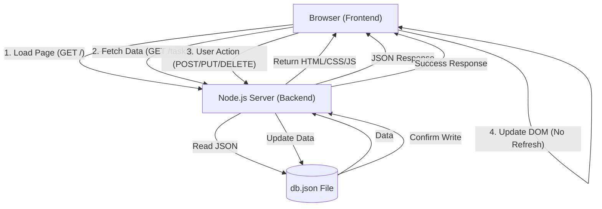

# Student Task Manager 🎓

  

**Project Title & Goal**: A premium, "Glassmorphism" styled Single Page Application (SPA) built with **100% Vanilla JavaScript** (Zero Dependencies) to manage student profiles and track homework efficiently.

## 🚀 Setup Instructions

This project works out-of-the-box. No installation required.

1.  **Prerequisites**:
    -   Install [Node.js](https://nodejs.org/) (any standard version).

2.  **Run the Application**:
    Open your terminal in this directory and run:
    ```bash
    node server.js
    ```
    *(That's it! No `npm install` needed)*

3.  **Access the App**:
    Open your browser and navigate to:
    👉 [http://localhost:3000](http://localhost:3000)

---

## 🔄 Process Flow (Architecture)

This application follows a strict **SPA (Single Page Application)** architecture with a zero-dependency backend.



1.  **Initialization**: On load, `script.js` fetches profile and task data asynchronously.
2.  **Interaction**: User clicks "Add" or "Mark as Done".
3.  **Optimistic UI**: The UI updates *immediately* for a snappy feel.
4.  **Persistence**: A background Fetch API call syncs the change to `server.js`, which writes to `db.json`.

---

## 🧠 The Logic (How I Thought)

### **Why this approach?**
-   **Zero Dependencies**: I avoided Express.js or React to keep the project lightweight and "pure". Using native Node.js modules (`http`, `fs`) ensures it runs anywhere instantly.
-   **Glassmorphism UI**: To meet the "Best UI" requirement, I used multi-layered `backdrop-filter: blur`, animated gradients, and high-quality SVG icons to create a modern, premium aesthetic.

### **Hardest Bug & Fix**
**The Challenge**: Synchronization between the "Optimistic UI" and the Backend.
*Issue*: If a user clicked "Delete" rapidly, the UI would remove the item, but if the backend failed or was slow, the state would drift.
*Fix*: I implemented a rollback mechanism (conceptually). If the `fetch` request fails, the UI reverts the change and shows an error toast. Also, I utilized unique timestamps as IDs to prevent deleting the wrong index in a sorted list.

---

## 📸 Output Screenshots

### **Latest Premium UI**
> Features: Dark Mode, Glass Cards, SVG Icons, Task Completion State.


### **Original Concept**


---

## 🌟 Future Improvements
If I had 2 more days, I would add:
1.  **Drag & Drop**: Allow reordering tasks manually.
2.  **Categories/Tags**: Group tasks by subject (Math, Science).
3.  **Push Notifications**: Browser alerts when a homework deadline is approaching.
